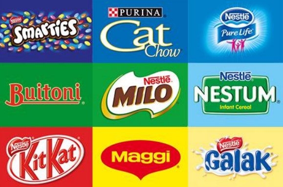
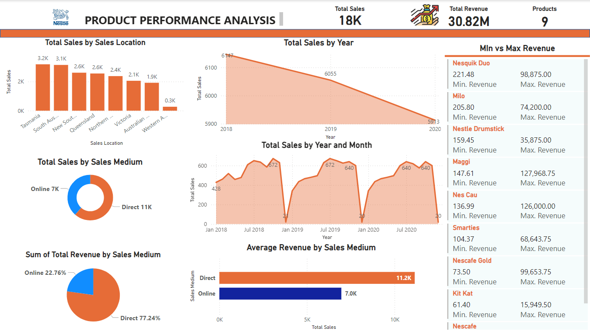

# Nestle Products Analytics Dashboard

## Table of Contents

- [Introduction](#introduction)
- [Data Cleaning and Preparation](#data-cleaning-and-preparation)
- [Detailed Insights and Recommendations](#detailed-insights-and-recommendations)
  

## Introduction
Nestle, the world's largest food company, is considering expanding its business by adding new product lines. However, the Head of Growth and Strategy suggested that it was important to know the performance of the current products before making any decisions.

## Objectives/Problem Statement
The main objectives of this project are:
- Develop a comprehensive product comparison dashboard to evaluate the performance of Nestlé's existing products.
- Provide insights that will guide Nestlé's strategic decisions regarding product development, marketing strategies, and potential adjustments to existing products.
- Identify high-potential areas for expansion based on data-driven insights.

## The Data

The data used for this project includes:
- **Sales data**: revenue, units sold, sales channels
- **Customer feedback**: ratings, reviews, satisfaction scores
- **Market trends**: competitor performance, market demands

## Data Cleaning and Preparation

The data was cleaned and prepared for analysis, which involved:
  -[Download Here](https://docs.google.com/spreadsheets/d/1QopHCVPxv8IUoPIvOTjJzJ7t9xJXGxfV/edit?usp=sharing&ouid=107983779059296754863&rtpof=true&sd=true)
- Handling missing values
- Removing duplicates
- Ensuring data consistency (e.g., date formats, product names)
- Merging data from different sources

## Skill/Concepts Demonstrated 
The following Power BI features were incorporated: 
- DAX
- Power query
- Data Modelling
- Filter
- Button

## Detailed Insights and Recommendations

### Overview of Sales Performance

The analysis of sales data from 2018 to 2020 reveals trends and patterns that can inform strategic decisions for future growth. The total sales figures indicate fluctuations over the years, with notable peaks and troughs.

#### Total Sales by Year
- **2018**: 6147 units
- **2019**: 5913 units
- **2020**: 6055 units

This data suggests a relatively stable sales trend, with a slight decline in 2019 followed by a recovery in 2020.

### Monthly Sales Trends
Sales data by month indicates significant seasonal fluctuations, particularly:

- **Peak Sales**: January 2018 and January 2020, with sales reaching 672 units.
- **Lowest Sales**: July 2018, July 2019, and July 2020, with sales dropping to approximately 20-21 units.

#### Recommendation
To address the seasonal drop in sales, consider implementing the following strategies:

- **Seasonal Promotions**: Launch targeted marketing campaigns during the low sales months to stimulate demand.
- **Product Bundling**: Offer bundled products or discounts during off-peak seasons to encourage purchases.

### Product Performance Analysis
The top performing products include Kit Kat, Maggi, Milo, Nes Cau, Nescafe, Nescafe Gold, Nesquik Duo, Nestle Drumstick, and Smarties. 

#### Revenue Analysis
- **Nesquik Duo**: Min Revenue: 98,875, Max Revenue: 221,480
- **Milo**: Min Revenue: 74,200, Max Revenue: 205,800
- **Maggi**: Min Revenue: 127,968, Max Revenue: 147,610

These products show a wide range in revenue, indicating variability in sales performance.

#### Recommendation
- **Focus on High-Performing Products**: Increase marketing efforts and stock levels for top-selling products to maximize sales.
- **Investigate Underperformers**: Analyze the reasons behind the lower sales of products like Nescafe Gold and Smarties, and consider adjustments in pricing, marketing, or product placement.

### Sales by Location
Sales distribution across various locations shows:

- **Top Locations**: 
  - Tasmania: 3.2K units
  - South Australia: 3.1K units
  - New South Wales: 2.6K units
  - Queensland: 2.6K units
- **Lowest Sales**: Australian Capital Territory: 0.3K units

#### Recommendation
- **Localized Marketing Strategies**: Tailor marketing efforts to the preferences and behaviors of consumers in top-performing regions while developing strategies to boost sales in the Australian Capital Territory and other underperforming areas.

### Sales Medium Analysis
Sales data indicates that direct sales account for 61.56% of total revenue, while online sales comprise 38.44%. The average revenue per unit is significantly higher for direct sales (11.2K) compared to online sales (7.0K).

#### Recommendation
- **Enhance Online Sales Channels**: Invest in improving the online shopping experience, including website optimization, user-friendly navigation, and targeted online advertising.
- **Incentivize Direct Purchases**: Encourage customers to buy directly from the company through loyalty programs or exclusive online offers.

### Conclusion
By leveraging these insights and implementing the recommended strategies, the company can enhance its sales performance, stabilize revenue streams, and drive growth across various product lines and markets. Continuous monitoring and adaptation to market trends will be essential for sustained success.
